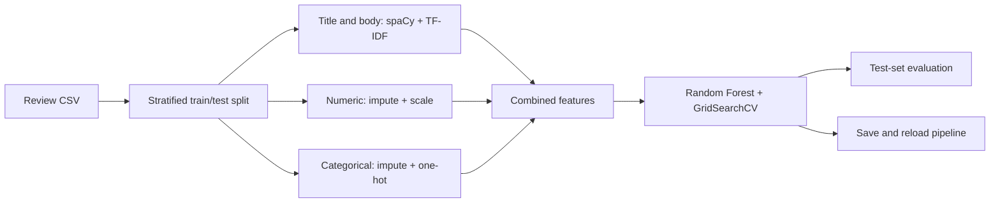

# Customer Review Recommendation Pipeline

Predict whether a clothing reviewer recommends a product by combining review text with structured attributes. A single scikit-learn pipeline handles text preparation, numerical and categorical features, and random-forest classification.

**Focus:** NLP · Mixed-Data Preprocessing · Model Selection · Model Serialization  
**Task:** Binary classification of `Recommended IND`, rather than personalized product ranking.

[Notebook](starter/starter.ipynb) · [Results](#results--validation) · [Run locally](#how-to-run--known-limitations)

## Features

- Separate spaCy and TF-IDF processing for review titles and bodies.
- Numerical imputation/scaling and categorical imputation/one-hot encoding through a `ColumnTransformer`.
- Stratified 80/20 train/test split with `random_state=42`.
- Random Forest training and five-fold grid search over 24 parameter combinations.
- Classification reports, confusion matrix, and initial-versus-tuned model comparison.
- Importable [TextProcessor](starter/text_processing.py) and a [serialization smoke check](smoke_runtime.py) using a fresh Python process.

## Tech stack

Python · pandas · NumPy · scikit-learn · spaCy · joblib · Matplotlib · seaborn · Jupyter

## Workflow



Numerical features: age and positive-feedback count. Categorical features: clothing ID, division, department, and class. Titles and review bodies use separate TF-IDF transforms with up to 100 and 500 features respectively.

## Results & validation

The values below are **saved notebook outputs**, not benchmarks reproduced for this documentation update.

| Metric | Initial model | Tuned model |
| --- | --- | --- |
| Accuracy | 0.8620 | 0.8634 |
| Recommended-class F1 | 0.9206 | 0.9214 |
| Not-recommended-class recall | 0.34 | 0.34 |
| Macro-F1 (rounded report) | 0.70 | 0.70 |

The saved report contains 3,011 recommended and 678 not-recommended reviews in the test set. The low negative-class recall shows why accuracy alone is insufficient.

**Recorded runtime check — 2026-09-14:** a new pipeline fitted on 512 stratified records successfully preserved predictions after joblib loading in a fresh process. This verifies serialization for that small newly trained model; the full grid search was not rerun.

**Existing artifact:** the 95.7 MB Git LFS pickle was retrieved and its hash matched the pointer, but loading failed with a MemoryError in serialized spaCy/preshed state. Use a newly trained artifact or recover the original environment; the old artifact has not been replaced.

## Visual preview

Evaluation charts are available inside the [notebook](starter/starter.ipynb). Standalone image slots are prepared below:

| Planned image | What it should show |
| --- | --- |
| `docs/screenshots/review-confusion-matrix.png` | Actual confusion matrix with class labels and run date |
| `docs/screenshots/review-model-comparison.png` | Actual initial-versus-tuned model chart |

<!-- Add only genuine exported notebook figures and identify saved versus freshly rerun output.


-->


## Contribution & attribution

The implementation described above is visible in the repository. A personal contribution breakdown is not documented; individual roles are therefore left unspecified. Existing attribution and licensing notes are preserved below.

## How to run & known limitations

Expand the original documentation below for the complete setup commands, limitations, provenance notes, and recorded verification. Its content has been preserved; the presentation update above does not introduce new runtime or benchmark claims.

<details>
<summary>Setup, limitations, and existing technical documentation</summary>

## Customer Review Recommendation Pipeline

A scikit-learn experiment predicting `Recommended IND` from clothing reviews and structured attributes. It combines spaCy preprocessing, TF-IDF, numerical imputation/scaling, categorical encoding, and a random forest.

## Contents

- [starter/starter.ipynb](starter/starter.ipynb): EDA, stratified split, training, GridSearchCV, and evaluation.
- [starter/data/reviews.csv](starter/data/reviews.csv): provided review data.
- `starter/recommendation_model.pkl`: Git LFS model artifact; a pointer is not a downloaded model. Git LFS is required when using the existing artifact.
- [requirements.txt](requirements.txt): original dependency list.

## Setup

```bash
git clone https://github.com/iimaha-AI/dsnd-pipelines-project-main1.git
cd dsnd-pipelines-project-main1
python -m venv .venv
```

Activate with `source .venv/bin/activate` on macOS/Linux or `.venv\Scripts\Activate.ps1` in PowerShell, then:

```bash
python -m pip install -r requirements.txt
python -m spacy download en_core_web_sm
cd starter
python -m notebook starter.ipynb
```

The dependency list is a starting environment, not a validated lockfile. Known execution limits are listed below.


Run from either the repository root or `starter/`; data and saved-model paths now resolve in both cases. Set `REVIEWS_DATA_PATH` for an external CSV. `OneHotEncoder(sparse_output=False)` requires a supporting scikit-learn version. The grid search has 24 combinations and five folds and may require substantial CPU time/memory.

## Model design and results

Numerical features are age and positive-feedback count. Categorical inputs include clothing ID, division, department, and class. Titles and review bodies use separate TF-IDF transforms. Splitting is stratified with `random_state=42`.

The previous README reported accuracy around 0.86, positive-class F1 around 0.92, and negative-class recall around 0.34. These are historical reported values, not revalidated metrics. Class imbalance makes accuracy and positive-class F1 insufficient descriptions of negative-review detection.

## Next steps

- Lock an environment and data hash after a clean rerun.
- Report majority baseline, macro-F1, per-class recall, and PR-AUC.
- Evaluate whether product-group splitting is necessary.
- `TextProcessor` now lives in `starter/text_processing.py`; keep that module available when loading newly trained artifacts.
- Run the loading/inference smoke check below. See [review notes](docs/REVIEW.md) for earlier findings.

## Attribution

Udacity Data Scientist Nanodegree project. Preserve [LICENSE.txt](LICENSE.txt) and verify the review dataset's source and distribution terms.

## Runtime repair — 2026-09-14

From the repository root, run `python smoke_runtime.py` after installing dependencies and `en_core_web_sm`. The check fits the existing pipeline on 512 stratified records from the supplied CSV with one CPU worker, then compares predictions before and after joblib loading in a fresh Python process. It passed under Python 3.12, pandas 2.3.3, scikit-learn 1.9.1, spaCy 3.8.7 and `en_core_web_sm` 3.8.0.

The transformer’s text-processing logic is unchanged. Old pickles referring to `__main__.TextProcessor` should be regenerated from the notebook; this repair does not rewrite the existing LFS artifact. The full 24-combination, five-fold search was not rerun, so no new benchmark is claimed. `scikit-learn>=1.2,<2` records the required `sparse_output` API. Keep `starter/` on Python’s import path when loading the model outside the notebook.

The existing 95.7 MB LFS artifact was retrieved and its SHA-256 matched the Git LFS pointer. Loading it in the test environment failed inside the serialized spaCy/preshed state with a MemoryError. It was not modified or replaced. Use a newly trained artifact from the corrected notebook, or recover the original training environment before using that old pickle. The successful serialization smoke test concerns a newly fitted 512-row model only.

</details>
